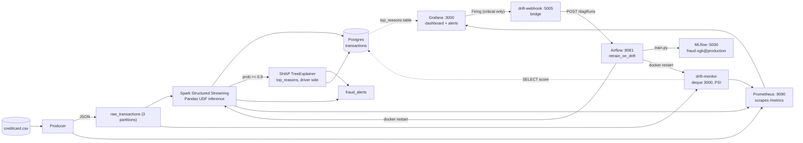

# 🔍 Real-Time Bank Fraud Detection Platform

Streaming fraud scoring on **Kafka + Spark Structured Streaming** with **XGBoost as a distributed Pandas UDF**. Full observability with Prometheus + Grafana, drift detection with PSI, auto-retrain with Airflow + MLflow, explainability with SHAP, data/model versioning with DVC, persistence in PostgreSQL.

> Built to learn production ML systems: micro-batch inference, train/serve contract, pull-based metrics, Grafana-as-code, event-driven retraining, per-prediction explainability.

## Architecture



**Why the model goes to the data:** the first version did `batch_df.toPandas()` on the driver and scored there, a single-machine bottleneck. Now the model is broadcast once and scored inside a `pandas_udf` on the executors. The driver only does I/O, metrics, alerting, and, for the small slice of high-confidence frauds, SHAP.

## Tech Stack

| Component | Technology |
|---|---|
| Message bus | Kafka Confluent 7.5, 2 topics: `raw_transactions`, `fraud_alerts` |
| Stream processing | Spark 3.4.1 Structured Streaming, Pandas UDF + broadcast, PyArrow 14 |
| Model | XGBoost 2.0, scikit-learn 1.3, StandardScaler on Amount/Time |
| Explainability | SHAP 0.44 (TreeExplainer), matplotlib 3.8.2 |
| Drift | Custom PSI + KS, window 3000, reference 10k rows |
| Tracking | MLflow 2.9.2 tracking + registry `models:/fraud-xgb@production` |
| Data/model versioning | DVC, local remote `dvcstore/` (`dvc repro`, `dvc push`) |
| Orchestration | Airflow 2.8.1-python3.10 (LocalExecutor) + `docker.sock` restart |
| Metrics | Prometheus 2.47 (pull model), Grafana 10.2 (provisioned) |
| Storage | Postgres 15: `transactions`, `batch_metrics`, `airflow`, `mlflow` |
| Language | Python 3.10 |

**Version pins:** Spark 3.4 needs pandas 1.5.3 / numpy 1.26 in the Spark image. The Airflow image must be `2.8.1-python3.10` because pandas 2.1.4 requires Python >= 3.9. `shap==0.44.0` and `matplotlib==3.8.2` are pinned the same way across `requirements-dev.txt`, `spark/requirements.txt`, and `airflow/requirements.txt`.

## Project Structure

```text
├── docker-compose.yml
├── .env                           # local/non-Docker defaults; containers get their env from compose, not this file
├── dvc.yaml / dvc.lock            # train stage: deps=train.py+csv, outs=model artifacts, metrics=metadata.json
├── dvcstore/                      # local DVC remote, `dvc push` target (gitignored, ~150MB of blobs)
├── data/creditcard.csv (+ .dvc)
├── model/
│   ├── train.py                   # saves model.pkl, scaler.pkl, metadata.json, reference_sample.parquet, shap_summary.png
│   ├── metadata.json              # FEATURE CONTRACT + metrics, single source of truth
│   ├── reference_sample.parquet   # 10k random RAW rows + score (DVC-tracked)
│   └── shap_summary.png           # global SHAP feature importance, logged to MLflow
├── producer/                      # producer.py, Dockerfile: stratified class sampling + drift injection via /tmp/drift.json
├── spark/                         # streaming_job.py: ModelManager, broadcast, UDF, SHAP explainer on driver
├── drift/                         # drift_math.py, monitor.py: pure PSI/KS, window, reference reload
├── airflow/                       # Dockerfile (python3.10), requirements.txt, dags/retrain_on_drift.py
├── webhook-bridge/                # app.py: translates Grafana {alerts} -> Airflow {conf}
├── monitoring/
│   ├── prometheus/prometheus.yml  # scrape targets: producer:8000, spark:8001, drift-monitor:8002
│   └── grafana/provisioning/
│       ├── datasources/
│       │   ├── prometheus.yaml    # uid: prometheus (MUST match dashboard)
│       │   └── postgres.yaml      # uid: postgres, used by the top_reasons table panel
│       ├── dashboards/            # dashboards.yaml + fraud_dashboard.json
│       └── alerting/              # drift_rules.yaml, contactpoints.yaml, policies.yaml
├── postgres/init/                 # 01-mlflow-db.sql (creates mlflow + airflow DBs), 02-airflow-db.sql
├── tools/                         # psi_baseline_check.py: proves random 0.0065 vs sequential 1.32
├── k8s/                           # k8s manifests (roadmap, in progress)
└── tests/                         # 15 tests: contract, scoring, producer schema, drift_math, config files
```

## Quick Start

Download the dataset to `./data/creditcard.csv` from [Kaggle](https://www.kaggle.com/datasets/mlg-ulb/creditcardfraud), then (PowerShell):

```powershell
python -m venv venv
.\venv\Scripts\activate
pip install -r requirements-dev.txt

# writes model/*.pkl + reference_sample.parquet + shap_summary.png, logs to MLflow if MLFLOW_TRACKING_URI is set
python model/train.py
# or, DVC-tracked:
dvc repro

docker compose up -d --build

# first time only, if the airflow DB wasn't created by postgres/init
# (01-mlflow-db.sql already creates it on a fresh volume, this is a fallback)
docker exec postgres psql -U fraud_user -d postgres -c "CREATE DATABASE airflow;"

# wait for "📦 Batch 0"
docker logs -f fraud-spark
```

> **Note:** `.env` is a convenience file for running services outside Docker. Inside `docker-compose.yml`, every service gets its environment injected directly (e.g. `KAFKA_BOOTSTRAP_SERVERS=kafka:29092`), which does not match the value in `.env` (`kafka:9092`). That's expected, not a bug.

| Service | URL |
|---|---|
| Grafana | http://localhost:3000/d/fraud-detection (anonymous admin) |
| Prometheus targets | http://localhost:9090/targets |
| Kafka UI | http://localhost:8080 |
| Spark UI | http://localhost:4040 |
| MLflow | http://localhost:5000 |
| Airflow | http://localhost:8081 (`airflow` / `airflow`) |
| Producer metrics | http://localhost:8000/metrics |
| Spark metrics | http://localhost:8001/metrics |
| Drift metrics | http://localhost:8002/metrics |
| Webhook health | http://localhost:5005/health |

## How It Works

### Producer

- Splits the dataset once into `legit_df` (`Class=0`) and `fraud_df` (`Class=1`).
- `PRODUCER_SAMPLING_MODE=random` (default): each tick computes `desired = min(0.5, base_fraud_rate * fraud_multiplier)`, rolls a coin against it, then draws one stratified sample: `fraud_df.sample(n=1)` or `legit_df.sample(n=1)`. This reproduces the original class-conditional feature distributions almost exactly, which is why PSI stays ~0.0065.
- `PRODUCER_SAMPLING_MODE=sequential` walks the CSV in row order (`df.iloc[seq_idx]`). Because the original dataset is time-ordered, this creates artificial local correlation: the first 3000 sequential rows measure PSI **1.32** (drifted) vs random's **0.0065** (healthy). See `tools/psi_baseline_check.py`.
- `build_message(row, id, drift_ctrl)` builds the JSON sent to Kafka: `Time, Amount, V1..V28, transaction_id, merchant_id, card_last_four, country, is_fraud_ground_truth`.
- Three independent drift knobs, read from `/tmp/drift.json` and polled every ~1s:
  - `shifts`: additive, `new = old + shift` (covariate shift)
  - `scales`: multiplicative, `new = old * scale` (covariate shift)
  - `fraud_multiplier`: multiplies the sampling probability of drawing a fraud row. This is a **prior/label shift**, not a feature shift, and is invisible to feature-level PSI; it would only show up in `drift_score_psi` (the score-distribution check) or in the ground-truth fraud rate.
- Example: `{"enabled": true, "shifts": {"V1": 3.0}, "scales": {"Amount": 3.0}, "fraud_multiplier": 1.0}`
- Metrics: `producer_drift_injection_active`, `producer_drift_shift{feature}`, `producer_drift_scale{feature}`, `producer_drift_fraud_multiplier`.

### Kafka

- `raw_transactions`: 3 partitions, 24h retention. The producer writes; Spark and drift-monitor both read (fan-out via different consumer groups).
- `fraud_alerts`: written by Spark, including `top_reasons` for high-confidence fraud. This is a Kafka topic, not a Postgres table (see the SHAP gotcha below).
- `__consumer_offsets`: internal.

| Consumer | Group | Reads from | In Kafka UI? |
|---|---|---|---|
| Spark | `spark-kafka-source-...` (auto) | `raw_transactions` latest, `maxOffsetsPerTrigger` 10k | Yes: Topics -> raw_transactions -> Groups |
| drift-monitor | `drift-monitor` | `raw_transactions` latest | Yes |

Spark **is** a Kafka consumer.

### Spark

`readStream.format("kafka")` -> parse JSON with schema -> `pandas_udf` scores partitions in parallel -> `foreachBatch` handles metrics, SHAP for high-confidence fraud, alerts to `fraud_alerts`, and a Postgres upsert on `transaction_id` (`ON CONFLICT ... DO UPDATE`, mainly relevant for idempotent replay after a checkpoint-driven restart).

### Explainability (SHAP)

Banks need "why did you flag this transaction?", not just a score.

- **Training:** `model/train.py` samples 1000 test rows, runs `shap.TreeExplainer(model)`, and saves a global `shap_summary.png` (logged as an MLflow artifact). It shows `V14`, `V4`, `V12` as the top global drivers of fraud: the "why does the model work overall" view. This is wrapped in `try/except` so a SHAP failure never breaks training.
- **Streaming:** only for high-confidence fraud, `fraud_probability >= 0.9`, not every transaction at 39.6 tps. `streaming_job.py` builds one `shap.TreeExplainer(model)` at startup, on the driver only (it is not part of the broadcast model dict and never runs inside the `pandas_udf` on executors). Inside `foreachBatch`, the batch is filtered to `prob >= 0.9` before SHAP runs; for each row the top 3 features are selected by **largest absolute SHAP value** (ranked by impact magnitude, not raw signed value, so a strongly negative contributor still shows up as a top reason). `top_reasons` is then attached to:
  - the Kafka `fraud_alerts` message: `{"top_reasons": {"V14": 6.07, "V17": -0.58, ...}}`
  - `transactions.top_reasons` in Postgres (added via `ALTER TABLE ... ADD COLUMN IF NOT EXISTS`, a safe migration on an existing DB)
  - logs: `TXN-00465582 | Score: 0.9811 | Reasons: V14=6.073, V17=-0.577`
- **Why gate on confidence:** at a 0.2% fraud rate and 39.6 tps that's ~0.08 fraud/sec, and high-confidence fraud is rarer still: roughly one SHAP call every ~30s, ~12ms each. Negligible next to the ~1.3s batch time, so latency stays low while every alert that matters gets an explanation.
- **New metrics on `:8001`:** `spark_shap_explanations_total` (counter), `spark_shap_duration_seconds` (histogram, buckets up to 2s).

> **Gotcha:** the Postgres table `fraud_alerts` is defined in `create_tables()` but is never inserted into. Only the Kafka topic `fraud_alerts` is written, by `AlertProducer`. If you query Postgres expecting alert payloads there, you'll find nothing; Kafka UI is the source of truth for alert messages. Also, rows inserted before SHAP shipped (or any row scoring below 0.9) have `top_reasons = NULL`, which is expected, not a bug.

### Drift monitor

A separate service, so a crash doesn't kill scoring.

- `deque(maxlen=3000)` holds the last 3000 live transactions in RAM, filled by a background thread consuming `raw_transactions` independently (own consumer group `drift-monitor`). Settings: `WINDOW_SIZE=3000`, `MIN_SAMPLES=1000`, `CHECK_INTERVAL=30s`.
- Reference = `model/reference_sample.parquet` (10k random rows saved at train time).
- Monitored features = everything in `metadata.json["features"]` **except `Time`**. `Time` is deliberately excluded from PSI/KS, since it's an offset counter with no stable distribution to compare against.
- Every 30s it computes PSI per feature (`psi(reference, current)`) plus KS, using quantile bins computed once from the reference distribution.
- Separately, it runs `SELECT fraud_probability ORDER BY id DESC LIMIT <window_size>` against Postgres (not the Kafka window) to produce `drift_score_psi`, so feature drift and score drift are measured from two different data sources.
- Exposes on `:8002`: `drift_psi{feature}`, `drift_max_psi`, `drift_features_drifted`, `drift_score_psi`, `drift_window_size`.
- Reloads the reference file when its mtime changes (after a retrain), without needing a container restart.

**Why window = 3000?** It's a count, not a time. With 10 bins that's always 300 samples per bin, which is stable. 200 is noisy, 50000 is slow.

Fill time = `window / actual_tps`. Actual TPS is **39.6**, not the target 100, because the loop is `sample + json + send + sleep(0.01)`: the `sleep` isn't compensated and pandas sampling adds overhead. So `3000 / 39.6 = 75s` (ideal would be `3000 / 100 = 30s`). After injecting drift: ~75s to replace the window + `for: 2m` in the alert = **~3 min to Firing**.

### Prometheus

Pull model. Each service calls `start_http_server(8000)` and increments counters in RAM, exposing plain text at `/metrics`. Prometheus reads `prometheus.yml` **at startup only**, then `GET http://producer:8000/metrics` every 15s per `scrape_configs` target and stores the time series.

- Check `http://localhost:9090/targets`: every job must be `1/1 up`, including `drift-monitor`.
- If you edit the yml on the host, restart Prometheus.

### Grafana

Grafana never talks to the producer directly, and only talks to Postgres for one panel. Everything else is Prometheus.

- `datasources/prometheus.yaml` must have `uid: prometheus`.
- Every Prometheus-backed panel in the dashboard JSON must use `"datasource": {"uid": "prometheus"}`.
- The old UID `PBFA97...` caused `Data source not found` and `No data`.
- `dashboards.yaml` tells Grafana where the JSON lives.
- `datasources/postgres.yaml` (`uid: postgres`) is used by exactly one panel: the **"Recent High-Confidence Frauds with Top Reasons"** table, which runs a raw SQL query against `transactions`. It's the only panel not backed by Prometheus, because `top_reasons` is a row-level value, not a time series.

### Alerting

`drift_rules.yaml` defines two independent rules, group `interval: 1m`, both `for: 2m`:

| Rule | Condition | Severity |
|---|---|---|
| `feature-drift-psi` | `drift_max_psi > 0.25` | `critical` |
| `score-drift-psi` | `drift_score_psi > 0.25` | `warning` |

- Query chain for both: `A = <metric> (instant)` -> `B = last(A)` -> `C = B > 0.25`.
- State flow: `Normal -> Pending (2m) -> Firing`. `Health: ok` means the config is valid.
- The list view always shows the raw `{{ $values.B.Value }}`; the rendered value is in the instance detail.
- **Only `severity=critical` reaches Airflow.** `policies.yaml` routes `severity=critical -> airflow-webhook`; everything else (including the `score-drift-psi` warning) falls through to the default email receiver and never triggers a retrain. So feature/covariate drift auto-retrains; score drift is currently observability-only.

**Contact points / policies:** `contactpoints.yaml` defines the webhook `http://drift-webhook:5005/grafana-webhook`; `policies.yaml` does the severity routing above. Both are provisioned **at startup only**. If the UI shows only email, the volume is stale: `docker compose down && docker volume rm grafana-data && docker compose up -d`.

### Webhook bridge

Grafana sends `{"alerts": [{"status": "firing", "labels": {"severity": "critical"}}]}`. Airflow expects `{"conf": {...}}` plus Basic Auth, so posting directly fails with `400`.

The bridge is pure format translation. It doesn't re-check severity, because Grafana's routing already filtered to critical-only before the webhook is even called. It wraps the payload as `{"conf": {"triggered_by": "grafana", "payload": data}}` and POSTs to `http://airflow-webserver:8080/api/v1/dags/retrain_on_drift/dagRuns`.

### Airflow DAG `retrain_on_drift`

`schedule=None`. Tasks:

1. `check_drift`: independently re-queries `PROM_URL/api/v1/query?query=drift_max_psi` (doesn't trust the webhook payload's content, just reacts to the fact that it fired). If `< 0.25` and not `force`, raises `AirflowSkipException` and all downstream tasks are skipped.
2. `check_cooldown`: reads `model/last_retrain.txt` (20 min cooldown, bypassed by `force: true`).
3. `train`: runs `model/train.py`, producing a new MLflow version, a new reference sample, and a refreshed `shap_summary.png`. Promotion to `@production` only happens if the new AUC-ROC is >= the current production model's.
4. `mark_retrain_time`: writes the marker file.
5. `deploy`: `docker restart fraud-spark drift-monitor` via `/var/run/docker.sock` (needs `user: "0:0"`), forcing both to reload the newly promoted model and the new reference parquet.

Manual trigger: Airflow UI -> Trigger DAG w/ config `{"force": true}`, or:

```powershell
python -c "import requests; requests.post('http://localhost:8081/api/v1/dags/retrain_on_drift/dagRuns', auth=('airflow','airflow'), json={'conf':{'force':True}})"
```

> PowerShell `curl.exe -d "{\"conf\":...}"` fails due to quoting. Use Python.

## Data & Model Versioning (DVC)

`dvc.yaml` defines a single `train` stage:

- **deps:** `model/train.py`, `data/creditcard.csv`
- **outs:** `model/fraud_model.pkl`, `model/scaler.pkl`, `model/reference_sample.parquet`, `model/shap_summary.png`
- **metrics:** `model/metadata.json` (`cache: false`, so it's tracked by git, not DVC)

`dvc repro` re-runs `train.py` only if a dependency changed (hash mismatch against `dvc.lock`). `dvc push` copies the resulting blobs to the local remote `dvcstore/` (gitignored, ~150MB) instead of committing binaries to git. `data/creditcard.csv.dvc` is the pointer file checked into git for the dataset itself.

```powershell
dvc repro      # retrain if train.py or the dataset changed
dvc push       # sync artifacts to dvcstore/
dvc pull       # restore artifacts on a fresh clone
```

## Demo

```powershell
# 1. Baseline: no drift
docker exec fraud-producer rm -f /tmp/drift.json
# wait ~90s, then expect drift_max_psi ~0.02
curl.exe -s http://localhost:8002/metrics | findstr drift_max_psi
# http://localhost:3000/alerting/list -> Normal

# 2. Inject covariate drift (PowerShell-safe: pipe into docker exec, don't use > inside sh -c)
'{"enabled": true, "shifts": {"V1": 3.0, "V14": 2.5}, "scales": {"Amount": 3.0}}' | docker exec -i fraud-producer sh -c 'cat > /tmp/drift.json'
docker exec fraud-producer cat /tmp/drift.json

# ~75s window fill + 120s (for: 2m) = ~3 min
# drift-monitor: max PSI 6.0+, drifted=10+ -> Grafana Firing (critical) -> webhook POST -> Airflow DAG runs
docker logs -f drift-monitor --tail 20
docker logs -f drift-webhook
docker logs -f airflow-scheduler --tail 50

# 3. Clear drift: back to ~0.02 / Normal after ~75s
docker exec fraud-producer rm /tmp/drift.json

# 4. Check explainability end-to-end
docker logs fraud-spark --tail 50 | findstr "Reasons:"
docker exec postgres psql -U fraud_user -d fraud_detection -c "SELECT transaction_id, fraud_probability, top_reasons FROM transactions WHERE top_reasons IS NOT NULL ORDER BY id DESC LIMIT 5;"
# Kafka UI -> fraud_alerts topic -> messages should include "top_reasons"

# 5. (Optional) Prior shift only: won't trigger feature PSI, only visible in score drift / fraud rate
'{"enabled": true, "fraud_multiplier": 5.0}' | docker exec -i fraud-producer sh -c 'cat > /tmp/drift.json'
curl.exe -s http://localhost:8002/metrics | findstr "drift_max_psi drift_score_psi"
```

## ML Model

Dataset: 284,807 transactions, 492 frauds (0.173%), 30 features. XGBoost with 100 trees, depth 6, `scale_pos_weight ~578`. The scaler is fitted once, jointly on Amount and Time. `metadata.json` is the single source of truth for feature order and scaled columns, validated at boot by both training and serving.

| Metric | Value |
|---|---|
| AUC-ROC | 0.9747 |
| Precision | 0.7810 |
| Recall | 0.8367 |
| F1 | 0.8079 |
| FPR | 0.0004 (23 FP / 56864 legit) |

`is_fraud_ground_truth` is in the Kafka message for validation only; a real system wouldn't have labels at inference time.

SHAP (`shap_summary.png`, logged to MLflow) confirms `V14`, `V4`, `V12` as the strongest global drivers of the fraud class, consistent with the per-transaction `top_reasons` seen in production alerts.

## Monitoring

Grafana panels:

- TPS: `sum(rate(producer_transactions_sent_total[1m]))`, ~39.6 actual vs 100 target
- Throughput: produced vs processed
- Fraud detected vs ground truth
- Batch latency P95, batch stats
- Score distribution
- PSI bar gauge (`drift_psi`, excludes `Time`), max PSI timeseries with 0.25 threshold
- Drifted features, score PSI, window size stats, drift injection on/off

**Explainability (SHAP):**

- `spark_shap_explanations_total` (stat)
- SHAP rate: `rate(spark_shap_explanations_total[5m])`
- SHAP latency P95/P50: `histogram_quantile(..., spark_shap_duration_seconds_bucket)`
- Table (Postgres datasource): recent high-confidence frauds with `top_reasons`, amount, country, `processed_at`

## Performance (Docker Desktop, Windows)

| Metric | Value |
|---|---|
| Producer | 39.6 tps actual (target 100; sampling + sleep overhead) |
| Batch | ~420 rows / 5s |
| Batch time | ~1.3s (P95 ~2s) |
| Inference | < 10 ms |
| SHAP (per high-confidence fraud) | ~12 ms |
| End-to-end | 5-7s |
| Recovery from checkpoint | 1-2 min |

## Development

```powershell
Remove-Item Env:MLFLOW_TRACKING_URI -ErrorAction SilentlyContinue
$env:PYTHONIOENCODING = "utf-8"
pytest -q tests   # 15 passed

docker compose down -v   # full reset: wipes kafka-data, checkpoints, DB
```

## Failure Modes Fixed

1. **Scaler fitted twice**, artifact only knew Time. Fixed with a single fit + contract guard.
2. **Feature order mismatch**: training `[Time, V.., Amount]` vs serving `[Time, Amount, V..]`. Fixed via `metadata.json` order, validated at boot in both `train.py` and `ModelManager._validate_contract()`.
3. **Pandas 2.x breaks Spark 3.4 `toPandas`**. Pinned pandas 1.5.3 / numpy 1.26.4 / pyarrow 14.
4. **Kafka `InconsistentClusterIdException`**. Fixed with `down -v`.
5. **Grafana UID `PBFA...` -> No data**. Fixed with `uid: prometheus` in datasource + dashboard.
6. **Alert Health Error `bad character $`**. `$$` vs `$` escaping, plus `data source not found`.
7. **Producer sequential mode created fake drift (PSI 1.32)**. Switched the default to stratified random sampling (0.0065).
8. **PowerShell `echo >` redirected on the host, not the container**. Use `| docker exec -i ... cat >`.
9. **Airflow Python 3.8 vs pandas 2.1.4 (needs >= 3.9)**. Use image `2.8.1-python3.10`.
10. **DAG skipped at PSI 0.02 < 0.25**. Expected when there is no drift; use `force: true`.
11. **Postgres `fraud_alerts` table queried for `top_reasons`, always empty.** That table is created but never written; the Kafka topic `fraud_alerts` is the real sink for alert payloads.
12. **Old rows show `top_reasons = NULL`.** Expected: SHAP was added after they were inserted, and it only fires for `prob >= 0.9` anyway, so most rows (legit traffic) will always be NULL.
13. **Grafana Postgres table panel empty after adding the datasource.** Either the volume is stale or the data predates the feature. Fix: `TRUNCATE transactions, batch_metrics, fraud_alerts;` then `docker compose restart fraud-spark`.
14. **`score-drift-psi` alert fires but Airflow never runs.** By design: only `severity: critical` (`feature-drift-psi`) is routed to the webhook; score drift is email-only/observability for now.

## Troubleshooting

- **`No data` on dashboard:** `docker exec grafana cat /etc/grafana/provisioning/datasources/prometheus.yaml` must show `uid: prometheus`, and dashboard panels must use the same UID.
- **Alert `Health: Error`:** `docker logs grafana --tail 20 | findstr template`, then look for `data source not found` / `bad character`.
- **DAG skipped:** `drift_max_psi` is < 0.25. Check with `curl.exe -s http://localhost:8002/metrics | findstr drift_max`.
- **`WARN KAFKA-1894`:** known Spark 3.4 bug, safe to ignore, batches still flow.
- **Airflow `Request body is not valid JSON`:** PowerShell quoting issue, use Python `requests`.
- **`top_reasons` always NULL in Postgres:** confirm you're querying `transactions` (not expecting a `fraud_alerts` table; it doesn't get written), and that the row is recent with `fraud_probability >= 0.9`.
- **SHAP table panel empty in Grafana:** truncate old data and restart Spark so new rows are inserted after SHAP is live:

  ```powershell
  docker exec postgres psql -U fraud_user -d fraud_detection -c "TRUNCATE transactions, batch_metrics, fraud_alerts;"
  docker compose restart fraud-spark
  ```

- **Injected `fraud_multiplier` but no alert fires:** expected. It only shifts the sampling prior, not feature values, so `drift_max_psi` (feature PSI) won't move. Watch `drift_score_psi` or the ground-truth fraud rate instead.

## Roadmap

- [x] CI: GitHub Actions lint + contract tests + docker build
- [x] MLflow tracking + registry
- [x] Pandas UDF + broadcast (replaced `toPandas`)
- [x] Drift monitoring (PSI) + Grafana alerts
- [x] Airflow auto-retrain + webhook bridge
- [x] DVC for `data/creditcard.csv`, `model/`, `reference_sample.parquet`
- [x] SHAP explainability on `fraud_alerts`
- [ ] Route `score-drift-psi` (prior/label shift) to retraining too, not just email
- [ ] Train on recent Postgres data, not just the CSV, so the retrained model adapts
- [ ] Kubernetes manifests, validated

## License

MIT