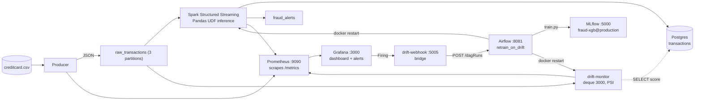

# 🔍 Real-Time Bank Fraud Detection Platform

Streaming fraud scoring on **Kafka + Spark Structured Streaming** with **XGBoost as a distributed Pandas UDF**. Full observability with Prometheus + Grafana, drift detection with PSI, auto-retrain with Airflow + MLflow, persistence in PostgreSQL.

> Built to learn production ML systems: micro-batch inference, train/serve contract, pull-based metrics, Grafana-as-code, event-driven retraining.

## Architecture



**Why the model goes to the data:** the first version did `batch_df.toPandas()` on the driver and scored there, a single-machine bottleneck. Now the model is broadcast once and scored inside a `pandas_udf` on the executors. The driver only does I/O.

## Tech Stack

| Component | Technology |
|---|---|
| Message bus | Kafka Confluent 7.5, 2 topics: `raw_transactions`, `fraud_alerts` |
| Stream processing | Spark 3.4.1 Structured Streaming, Pandas UDF + broadcast, PyArrow 14 |
| Model | XGBoost 2.0, scikit-learn 1.3, StandardScaler on Amount/Time |
| Drift | Custom PSI + KS, window 3000, reference 10k rows |
| Tracking | MLflow 2.9.2 tracking + registry `models:/fraud-xgb@production` |
| Orchestration | Airflow 2.8.1-python3.10 (LocalExecutor) + `docker.sock` restart |
| Metrics | Prometheus 2.47 (pull model), Grafana 10.2 (provisioned) |
| Storage | Postgres 15: `transactions`, `batch_metrics`, `airflow`, `mlflow` |
| Language | Python 3.10 |

**Version pins:** Spark 3.4 needs pandas 1.5.3 / numpy 1.26 in the Spark image. The Airflow image must be `2.8.1-python3.10` because pandas 2.1.4 requires Python >= 3.9.

## Project Structure

```text
├── docker-compose.yml
├── .env
├── data/creditcard.csv
├── model/
│   ├── train.py                  # saves model.pkl, scaler.pkl, metadata.json, reference_sample.parquet
│   ├── metadata.json             # FEATURE CONTRACT + metrics, single source of truth
│   └── reference_sample.parquet  # 10k random RAW rows + score (committed for now, DVC later)
├── producer/                     # producer.py, Dockerfile: random sampling + drift injection via /tmp/drift.json
├── spark/                        # streaming_job.py: ModelManager, broadcast, UDF
├── drift/                        # drift_math.py, monitor.py: pure PSI, window, reference reload
├── airflow/                      # Dockerfile (python3.10), requirements.txt, dags/retrain_on_drift.py
├── webhook-bridge/               # app.py: translates Grafana {alerts} -> Airflow {conf}
├── monitoring/
│   ├── prometheus/prometheus.yml # scrape targets: producer:8000, spark:8001, drift-monitor:8002
│   └── grafana/provisioning/
│       ├── datasources/prometheus.yaml  # uid: prometheus (MUST match dashboard)
│       ├── dashboards/                  # dashboards.yaml + fraud_dashboard.json
│       └── alerting/                    # drift_rules.yaml, contactpoints.yaml, policies.yaml
├── postgres/init/                # 01-mlflow-db.sql, 02-airflow-db.sql
├── tools/                        # psi_baseline_check.py: proves random 0.0065 vs sequential 1.32
└── tests/                        # 12 tests: contract, scoring, producer schema, drift_math
```

## Quick Start

Download the dataset to `./data/creditcard.csv` from [Kaggle](https://www.kaggle.com/datasets/mlg-ulb/creditcardfraud), then (PowerShell):

```powershell
python -m venv venv
.\venv\Scripts\activate
pip install -r requirements-dev.txt

# writes model/*.pkl + reference_sample.parquet, logs to MLflow if MLFLOW_TRACKING_URI is set
python model/train.py

docker compose up -d --build

# first time only, if the airflow DB wasn't created by postgres/init
docker exec postgres psql -U fraud_user -d postgres -c "CREATE DATABASE airflow;"

# wait for "📦 Batch 0"
docker logs -f fraud-spark
```

| Service | URL |
|---|---|
| Grafana | http://localhost:3000/d/fraud-detection (anonymous admin) |
| Prometheus targets | http://localhost:9090/targets |
| Kafka UI | http://localhost:8080 |
| Spark UI | http://localhost:4040 |
| MLflow | http://localhost:5000 |
| Airflow | http://localhost:8081 (`airflow` / `airflow`) |
| Producer metrics | http://localhost:8000/metrics |
| Spark metrics | http://localhost:8001/metrics |
| Drift metrics | http://localhost:8002/metrics |
| Webhook health | http://localhost:5005/health |

## How It Works

### Producer

- Loads the CSV into `to_dict('records')` and uses `random.choice`. Not `df.sample()` per message, not `iterrows()`.
- `PRODUCER_SAMPLING_MODE=random` gives a stationary stream. The old sequential mode created fake drift: random 3000 rows gave PSI **0.0065** (healthy) vs the first 3000 sequential rows at PSI **1.32** (drifted). See `tools/psi_baseline_check.py`.
- `build_message(row, id, drift_ctrl=None)` builds the JSON sent to Kafka: `Time, Amount, V1..V28, transaction_id, merchant_id, ...`.
- If `/tmp/drift.json` exists, e.g. `{"enabled": true, "shifts": {"V1": 3.0}, "scales": {"Amount": 3.0}}`, each value becomes `new = old * scale + shift`.
- Metric `producer_drift_injection_active` is 0 or 1.

### Kafka

- `raw_transactions`: 3 partitions, 24h retention. The producer writes; Spark and drift-monitor both read (fan-out via different consumer groups).
- `fraud_alerts`: written by Spark.
- `__consumer_offsets`: internal.

| Consumer | Group | Reads from | In Kafka UI? |
|---|---|---|---|
| Spark | `spark-kafka-source-...` (auto) | `raw_transactions` latest, `maxOffsetsPerTrigger` 10k | Yes: Topics -> raw_transactions -> Groups |
| drift-monitor | `drift-monitor` | `raw_transactions` latest | Yes |

Spark **is** a Kafka consumer.

### Spark

`readStream.format("kafka")` -> parse JSON with schema -> `pandas_udf` scores partitions in parallel -> `foreachBatch` handles metrics, alerts to `fraud_alerts`, and a Postgres upsert on `transaction_id`.

### Drift monitor

A separate service, so a crash doesn't kill scoring.

- `deque(maxlen=3000)` holds the last 3000 live transactions in RAM. Settings: `WINDOW_SIZE=3000`, `MIN_SAMPLES=1000`, `CHECK_INTERVAL=30s`.
- Reference = `model/reference_sample.parquet` (10k random rows saved at train time).
- Every 30s it computes PSI per feature, `psi(reference, current)`, plus KS.
- It also runs `SELECT fraud_probability ORDER BY id DESC LIMIT 3000` to produce `drift_score_psi`.
- Exposes on `:8002`: `drift_psi{feature}`, `drift_max_psi`, `drift_features_drifted`, `drift_score_psi`, `drift_window_size`.
- Reloads the reference file when its mtime changes (after a retrain).

**Why window = 3000?** It's a count, not a time. With 10 bins that's always 300 samples per bin, which is stable. 200 is noisy, 50000 is slow.

Fill time = `window / actual_tps`. Actual TPS is **39.6**, not the target 100, because the loop is `random.choice + json + send + sleep(0.01)`: the `sleep` isn't compensated and pandas adds overhead. So `3000 / 39.6 = 75s` (ideal would be `3000 / 100 = 30s`). After injecting drift: ~75s to replace the window + `for: 2m` in the alert = **~3 min to Firing**.

### Prometheus

Pull model. Each service calls `start_http_server(8000)` and increments counters in RAM, exposing plain text at `/metrics`. Prometheus reads `prometheus.yml` **at startup only**, then `GET http://producer:8000/metrics` every 15s per `scrape_configs` target and stores the time series.

- Check `http://localhost:9090/targets`: every job must be `1/1 up`, including `drift-monitor`.
- If you edit the yml on the host, restart Prometheus.

### Grafana

Grafana never talks to the producer. It reads Prometheus through a datasource.

- `datasources/prometheus.yaml` must have `uid: prometheus`.
- Every panel in the dashboard JSON must have `"datasource": {"uid": "prometheus"}`.
- The old UID `PBFA97...` caused `Data source not found` and `No data`.
- `dashboards.yaml` tells Grafana where the JSON lives.

### Alerting

- `drift_rules.yaml`: group `interval: 1m`, rule `condition: C`, `for: 2m`.
- Query chain: `A = drift_max_psi (instant)` -> `B = last(A)` -> `C = B > 0.25`.
- State flow: `Normal -> Pending (2m) -> Firing`. `Health: ok` means the config is valid.
- The list view always shows the raw `{{ $values.B.Value }}`; the rendered value is in the instance detail.

**Contact points / policies:** `contactpoints.yaml` defines the webhook `http://drift-webhook:5005/grafana-webhook`; `policies.yaml` routes `severity=critical -> airflow-webhook`. Both are provisioned **at startup only**. If the UI shows only email, the volume is stale: `docker compose down && docker volume rm grafana-data && docker compose up -d`.

### Webhook bridge

Grafana sends `{"alerts": [{"status": "firing", "labels": {"severity": "critical"}}]}`. Airflow expects `{"conf": {...}}` plus Basic Auth, so posting directly fails with `400`. The bridge translates and POSTs to `http://airflow-webserver:8080/api/v1/dags/retrain_on_drift/dagRuns`.

### Airflow DAG `retrain_on_drift`

`schedule=None`. Tasks:

1. `check_drift`: queries `PROM_URL/api/v1/query?query=drift_max_psi`. If `< 0.25` and not `force`, raises `AirflowSkipException` and all downstream tasks are skipped.
2. `check_cooldown`: reads `model/last_retrain.txt` (20 min cooldown).
3. `train`: runs `model/train.py`, producing a new MLflow version + new reference.
4. `mark_retrain_time`: writes the marker file.
5. `deploy`: `docker restart fraud-spark drift-monitor` via `/var/run/docker.sock` (needs `user: "0:0"`).

Manual trigger: Airflow UI -> Trigger DAG w/ config `{"force": true}`, or:

```powershell
python -c "import requests; requests.post('http://localhost:8081/api/v1/dags/retrain_on_drift/dagRuns', auth=('airflow','airflow'), json={'conf':{'force':True}})"
```

> PowerShell `curl.exe -d "{\"conf\":...}"` fails due to quoting. Use Python.

## Demo

```powershell
# 1. Baseline: no drift
docker exec fraud-producer rm -f /tmp/drift.json
# wait ~90s, then expect drift_max_psi ~0.02
curl.exe -s http://localhost:8002/metrics | findstr drift_max_psi
# http://localhost:3000/alerting/list -> Normal

# 2. Inject drift (PowerShell-safe: pipe into docker exec, don't use > inside sh -c)
'{"enabled": true, "shifts": {"V1": 3.0, "V14": 2.5}, "scales": {"Amount": 3.0}}' | docker exec -i fraud-producer sh -c 'cat > /tmp/drift.json'
docker exec fraud-producer cat /tmp/drift.json

# ~75s window fill + 120s (for: 2m) = ~3 min
# drift-monitor: max PSI 6.0+, drifted=10+ -> Grafana Firing -> webhook POST -> Airflow DAG runs
docker logs -f drift-monitor --tail 20
docker logs -f drift-webhook
docker logs -f airflow-scheduler --tail 50

# 3. Clear drift: back to ~0.02 / Normal after ~75s
docker exec fraud-producer rm /tmp/drift.json
```

## ML Model

Dataset: 284,807 transactions, 492 frauds (0.173%), 30 features. XGBoost with 100 trees, depth 6, `scale_pos_weight ~578`. The scaler is fitted on Amount and Time together. `metadata.json` is the single source of truth for feature order and scaled columns, validated at boot.

| Metric | Value |
|---|---|
| AUC-ROC | 0.9747 |
| Precision | 0.7810 |
| Recall | 0.8367 |
| F1 | 0.8079 |
| FPR | 0.0004 (23 FP / 56864 legit) |

`is_fraud_ground_truth` is in the Kafka message for validation only; a real system wouldn't have labels at inference time.

## Monitoring

Grafana panels:

- TPS: `sum(rate(producer_transactions_sent_total[1m]))`, ~39.6 actual vs 100 target
- Throughput: produced vs processed
- Fraud detected vs ground truth
- Batch latency P95, batch stats
- Score distribution
- PSI bar gauge (`drift_psi`), max PSI timeseries with 0.25 threshold
- Drifted features, score PSI, window size stats

## Performance (Docker Desktop, Windows)

| Metric | Value |
|---|---|
| Producer | 39.6 tps actual (target 100; pandas sample + sleep overhead) |
| Batch | ~420 rows / 5s |
| Batch time | ~1.3s (P95 ~2s) |
| Inference | < 10 ms |
| End-to-end | 5-7s |
| Recovery from checkpoint | 1-2 min |

## Development

```powershell
Remove-Item Env:MLFLOW_TRACKING_URI -ErrorAction SilentlyContinue
$env:PYTHONIOENCODING = "utf-8"
pytest -q tests   # 12 passed

docker compose down -v   # full reset: wipes kafka-data, checkpoints, DB
```

## Failure Modes Fixed

1. **Scaler fitted twice**, artifact only knew Time. Fixed with a single fit + contract guard.
2. **Feature order mismatch**: training `[Time, V.., Amount]` vs serving `[Time, Amount, V..]`. Fixed via `metadata.json` order.
3. **Pandas 2.x breaks Spark 3.4 `toPandas`**. Pinned pandas 1.5.3 / numpy 1.26.4 / pyarrow 14.
4. **Kafka `InconsistentClusterIdException`**. Fixed with `down -v`.
5. **Grafana UID `PBFA...` -> No data**. Fixed with `uid: prometheus` in datasource + dashboard.
6. **Alert Health Error `bad character $`**. `$$` vs `$` escaping, plus `data source not found`.
7. **Producer sequential mode created fake drift (PSI 1.32)**. Switched to random (0.0065).
8. **PowerShell `echo >` redirected on the host, not the container**. Use `| docker exec -i ... cat >`.
9. **Airflow Python 3.8 vs pandas 2.1.4 (needs >= 3.9)**. Use image `2.8.1-python3.10`.
10. **DAG skipped at PSI 0.02 < 0.25**. Expected when there is no drift; use `force: true`.

## Troubleshooting

- **`No data` on dashboard:** `docker exec grafana cat /etc/grafana/provisioning/datasources/prometheus.yaml` must show `uid: prometheus`, and dashboard panels must use the same UID.
- **Alert `Health: Error`:** `docker logs grafana --tail 20 | findstr template`, then look for `data source not found` / `bad character`.
- **DAG skipped:** `drift_max_psi` is < 0.25. Check with `curl.exe -s http://localhost:8002/metrics | findstr drift_max`.
- **`WARN KAFKA-1894`:** known Spark 3.4 bug, safe to ignore, batches still flow.
- **Airflow `Request body is not valid JSON`:** PowerShell quoting issue, use Python `requests`.

## Roadmap

- [x] CI: GitHub Actions lint + contract tests + docker build
- [x] MLflow tracking + registry
- [x] Pandas UDF + broadcast (replaced `toPandas`)
- [x] Drift monitoring (PSI) + Grafana alerts
- [x] Airflow auto-retrain + webhook bridge
- [ ] DVC for `data/creditcard.csv`, `model/`, `reference_sample.parquet`
- [ ] SHAP explainability on `fraud_alerts`
- [ ] Train on recent Postgres data, not just the CSV, so the retrained model adapts
- [ ] Kubernetes manifests, validated

## License

MIT